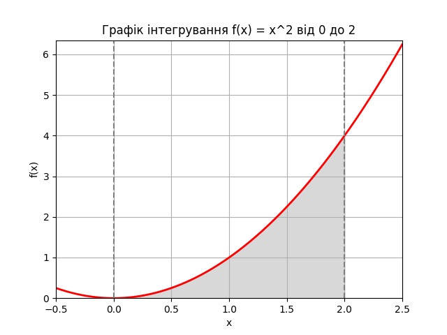

## Завдання 1. Оптимізація виробництва

Компанія виробляє два види напоїв: "Лимонад" і "Фруктовий сік". Для виробництва цих напоїв використовуються різні інгредієнти та обмежена кількість обладнання. Задача полягає у максимізації виробництва, враховуючи обмежені ресурси.

**Умови завдання:**

1. "Лимонад" виготовляється з "Води", "Цукру" та "Лимонного соку".

2. "Фруктовий сік" виготовляється з "Фруктового пюре" та "Води".

3. Обмеження ресурсів: 100 од. "Води", 50 од. "Цукру", 30 од. "Лимонного соку" та 40 од. "Фруктового пюре".

4. Виробництво одиниці "Лимонаду" вимагає 2 од. "Води", 1 од. "Цукру" та 1 од. "Лимонного соку".

5. Виробництво одиниці "Фруктового соку" вимагає 2 од. "Фруктового пюре" та 1 од. "Води".

Використовуючи `PuLP`, створіть модель, яка визначає, скільки "Лимонаду" та "Фруктового соку" потрібно виробити для максимізації загальної кількості продуктів, дотримуючись обмежень на ресурси. Напишіть програму, код якої максимізує загальну кількість вироблених продуктів "Лимонад" та "Фруктовий сік", враховуючи обмеження на кількість ресурсів.

## Завдання 2. Обчислення визначеного інтеграла

Ваше друге завдання полягає в обчисленні значення інтеграла функції методом `Монте-Карло`.

Виконаємо побудову графіка.

```python
import matplotlib.pyplot as plt
import numpy as np

# Визначення функції та межі інтегрування
def f(x):
    return x ** 2

a = 0  # Нижня межа
b = 2  # Верхня межа

# Створення діапазону значень для x
x = np.linspace(-0.5, 2.5, 400)
y = f(x)

# Створення графіка
fig, ax = plt.subplots()

# Малювання функції
ax.plot(x, y, 'r', linewidth=2)

# Заповнення області під кривою
ix = np.linspace(a, b)
iy = f(ix)
ax.fill_between(ix, iy, color='gray', alpha=0.3)

# Налаштування графіка
ax.set_xlim([x[0], x[-1]])
ax.set_ylim([0, max(y) + 0.1])
ax.set_xlabel('x')
ax.set_ylabel('f(x)')

# Додавання меж інтегрування та назви графіка
ax.axvline(x=a, color='gray', linestyle='--')
ax.axvline(x=b, color='gray', linestyle='--')
ax.set_title('Графік інтегрування f(x) = x^2 від ' + str(a) + ' до ' + str(b))
plt.grid()
plt.show()
```

Отримаємо наступний результат.



1. Обчисліть значення інтеграла функції за допомогою методу `Монте-Карло`, інакше кажучи, знайдіть площу під цим графіком (сіра зона).

2. Перевірте правильність розрахунків, щоб підтвердити точність методу `Монте-Карло`, шляхом порівняння отриманого результату та аналітичних розрахунків або результату виконання функції quad. Зробіть висновки.

Для перевірки обчислення визначеного інтеграла в `Python` ви можете використовувати бібліотеку `SciPy`, зокрема її функцію quad з підмодуля `integrate`. Спочатку необхідно визначити функцію, яку ви хочете інтегрувати, а потім використати `quad` для обчислення інтеграла на заданому інтервалі.

Приклад застосування функції `quad`

```python
import scipy.integrate as spi

# Визначте функцію, яку потрібно інтегрувати, наприклад, f(x) = x^2
def f(x):
    return x**2

# Визначте межі інтегрування, наприклад, від 0 до 1
a = 0  # нижня межа
b = 2  # верхня межа

# Обчислення інтеграла
result, error = spi.quad(f, a, b)

print("Інтеграл: ", result, error)
```

У цьому прикладі, функція `quad` повертає два значення: результат інтегрування та оцінку абсолютної помилки.

Виведення:

```
Інтеграл:  2.666666666666667 2.960594732333751e-14
```
